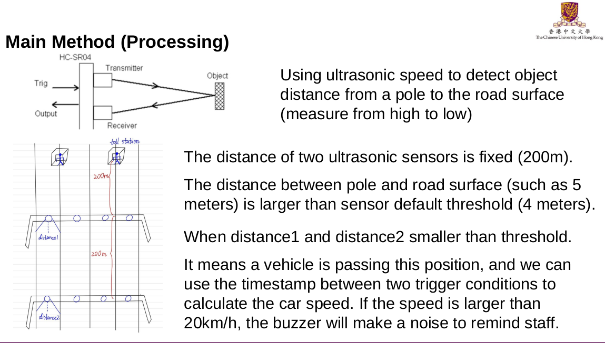
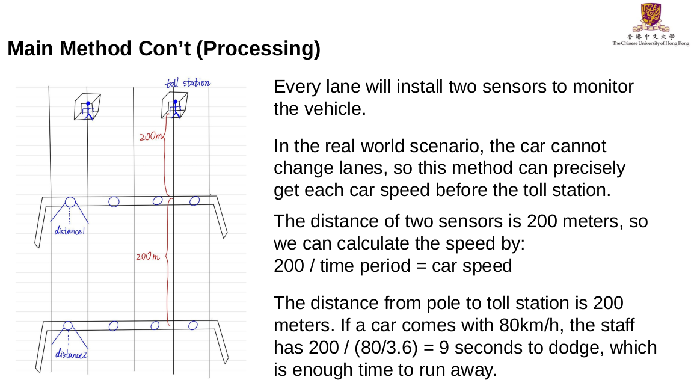
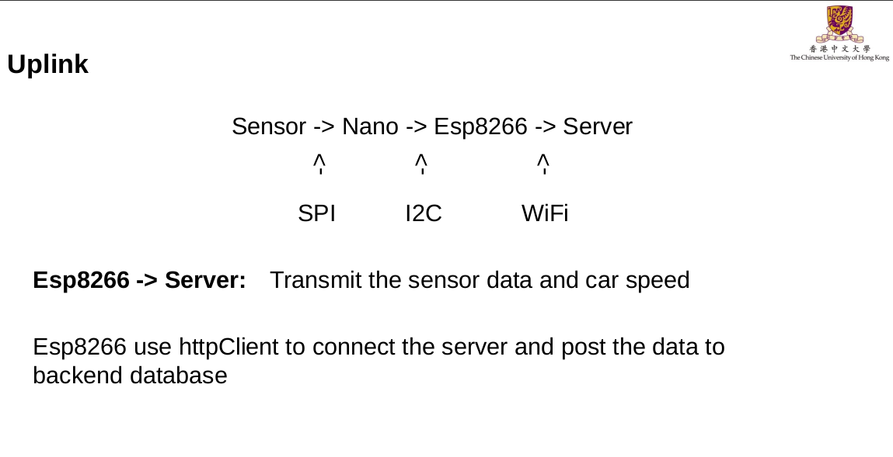
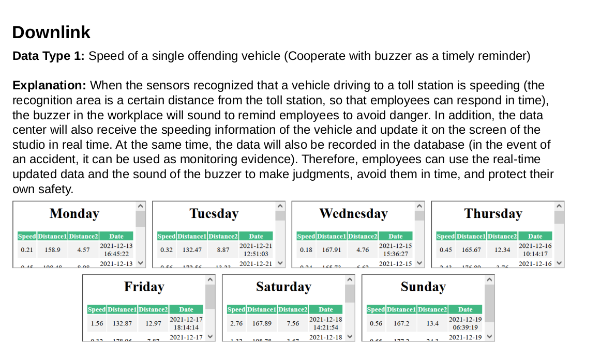
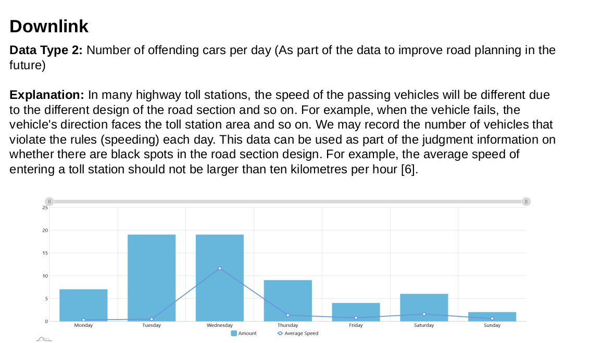

# Employee Safety at Highway Toll Plaza

## Problem & Object

Problem:

1. How to ensure the safety of staff
2. How to know the car speed

Object:

1. Save life

## Hardware

- Nano
- ESP8266

## Software (Backend)

- PHP

## Input

**Sensor:** two ultrasonic sensors (range:0~400cm)

- NA0, NA1 First ultrasonic sensor
- NA2, NA3 Second ultrasonic sensor

**Switches:** control pass data to cloud or not (LED5)

**Processor:** Nano (master) and esp8266 (slave)

## Output

**Sensor:** Beeper (buzzer)

## Main Method

## Uplink

## Downlink

